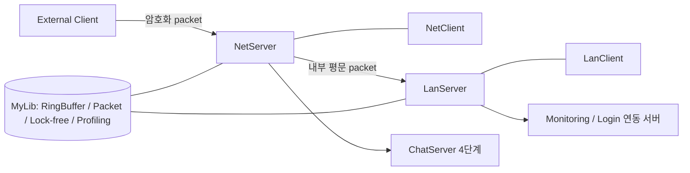

# IOCPServer

> Windows IOCP 네트워크 라이브러리를 내부망·외부망 두 계층으로 나누고, 그 위에 채팅 서버를 4단계로 확장한 게임 서버 기반 저장소

`C++17 / C++20` · `Windows` · `TCP / IOCP` · `Packet Encryption` · `Lock-free` · `Redis`

## 프로젝트 한눈에 보기

| 항목 | 내용 |
|---|---|
| 역할 | 이후 포트폴리오 서버들이 공통으로 쓰는 IOCP 네트워크 계층의 원형 |
| 계층 분리 | 내부 통신 `LanServer` / `LanClient`, 외부 통신 `NetServer` / `NetClient` |
| LAN 헤더 | `len` 2byte 단일 필드. 암호화·검증 없음 |
| Net 헤더 | `code` · `len` · `randKey` · `checkSum` 5byte. payload 암호화 |
| 공통 자료구조 | ring buffer, 직렬화 packet, lock-free queue/stack/freelist, TLS freelist |
| 확장 순서 | 채팅 기준선 → 다중 worker → 모니터링 연동 → 로그인 연동 |

## 계층 구조

외부에서 들어오는 트래픽만 암호화 비용을 치르고, 신뢰된 내부망 구간은 길이 헤더만 붙여 그대로 흘립니다.

## 핵심 구현

### 1. LAN / WAN 계층 분리

- 내부망 구간은 `unsigned short len` 하나뿐인 2byte 헤더를 쓰고 암호화·체크섬을 두지 않습니다.
- 외부망 구간은 5byte 헤더와 payload 암호화를 적용합니다.
- 두 헤더 정의는 [`MyLib/Define.h`](MyLib/Define.h)의 `LANHeader`, `NetHeader`에 있습니다.

### 2. 2-key XOR 스트림 암호와 체크섬

- 서버·클라이언트가 공유하는 고정키와, 패킷마다 새로 만드는 랜덤키(`randKey`) 두 개를 씁니다.
- 고정키는 소스 상수가 아니라 서버 설정 파일의 `SERVER.PACKET_KEY` 값이 시작 시 주입됩니다
  (`ChatServer.cpp` → `NetServer::Start` → `CPacket::SetKey`).
- 랜덤키는 암호화하지 않고 헤더에 그대로 실어 보냅니다. 같은 payload라도 매 패킷 결과가 달라집니다.
- 직전 바이트의 결과와 `randKey`, 바이트 위치를 함께 XOR해 반복 패턴이 암호문에 드러나지 않게 합니다.
- 비트 연산 복호화는 키가 틀려도 "실패"를 스스로 알 수 없으므로, payload 바이트 합을 256으로 나눈
  체크섬을 비교해 복호화 성공 여부를 판정합니다.
- 구현은 [`IOCPNetServer/SerializingBuffer.cpp`](IOCPNetServer/SerializingBuffer.cpp)의 encode/decode 경로에 있습니다.

### 3. 채팅 서버 4단계 확장

같은 채팅 기능을 기준선부터 단계적으로 확장하며 처리 모델과 외부 연동을 비교한 구성입니다.

| 프로젝트 | 처리 모델 | 외부 연동 |
|---|---|---|
| [`IOCPChatServer`](IOCPChatServer) | 단일 job thread가 job queue를 직렬 처리 | 없음 |
| [`IOCPChatServer_Multi`](IOCPChatServer_Multi) | job thread 없이 다중 worker가 직접 처리 | 없음 |
| [`IOCPChatServer_MonitorVer`](IOCPChatServer_MonitorVer) | 단일 job thread | 모니터링 LAN client |
| [`IOCPCharServer_LoginVer`](IOCPCharServer_LoginVer) | 단일 job thread | 모니터링 LAN client + Redis 세션 검증 |

> 마지막 프로젝트 이름의 `Char`는 `Chat` 오타이나, 원본 디렉터리 철자를 그대로 유지했습니다.

### 4. 공통 라이브러리와 관측

- [`MyLib`](MyLib)는 `NetServer`, `RingBuffer`, `Packet`, lock-free 컨테이너, `Profiling`,
  `CrashDump`, `TextParser`를 모아둔 기준 라이브러리 프로젝트입니다.
- 각 서버 프로젝트는 이 라이브러리를 참조하지 않고 **사본을 각자 보유**합니다.
  변형별로 코드를 독립 수정하며 비교하려던 당시 구성이 그대로 남아 있습니다.
- [`PerformanceMonitor`](PerformanceMonitor)는 PDH 기반 CPU·네트워크 지표 수집 코드입니다.

## 코드 탐색

| 경로 | 설명 |
|---|---|
| [`IOCPLanServer.sln`](IOCPLanServer.sln) | Visual Studio solution — 9개 프로젝트 |
| [`MyLib/Define.h`](MyLib/Define.h) | LAN/Net 헤더 구조와 패킷 상수 |
| [`MyLib/NetServer.cpp`](MyLib/NetServer.cpp) | IOCP accept·send·recv 완료 처리와 세션 수명 |
| [`MyLib/RingBuffer.cpp`](MyLib/RingBuffer.cpp) | 세션 수신·송신 버퍼 |
| [`MyLib/LockFreeQueue.h`](MyLib/LockFreeQueue.h) | job queue에 쓰이는 lock-free 컨테이너 |
| [`IOCPNetServer/SerializingBuffer.cpp`](IOCPNetServer/SerializingBuffer.cpp) | 패킷 직렬화와 encode/decode |

## 빌드 및 실행 전제

- Visual Studio 2022 toolset `v143`, Windows 10 SDK
- 언어 표준이 프로젝트·구성마다 다릅니다 — `stdcpp17`과 `stdcpp20`이 섞여 있습니다
- WinSock2, Windows multimedia timer. 로그인 연동본은 번들된 `cpp_redis` · `tacopie`와 실행 중인 Redis 필요
- 각 서버의 `*.txt` 설정 파일에서 bind 주소·포트·worker 수를 환경에 맞게 교체
- solution을 x64로 열면 9개 프로젝트가 함께 로드됩니다

> 저장소에는 과거 로컬 환경 기준의 번들 라이브러리(`.lib`)와 프로파일링 결과가 함께 들어 있습니다.
> 깨끗한 머신에서의 재현 빌드는 아직 검증하지 않았습니다.

## 현재 상태

게임 서버 네트워크 계층을 처음부터 직접 구성해 본 학습 기준선입니다. 다음은 이미 확인된 한계이며
후속 현대화에서 우선 다룰 영역입니다.

- 랜덤키를 `rand()`로 생성합니다. 암호학적 난수가 아니며, 1byte 키를 쓰는 이 방식 자체가 무작위
  대입에 약한 **난독화 수준**입니다. 기밀성이 필요한 용도에 쓰지 마십시오.
- 고정키가 저장소에 함께 커밋된 설정 파일에 평문으로 들어 있습니다(`SERVER.PACKET_KEY`).
  `MyLib/Define.h` 의 `KEY` 상수는 어디에서도 참조되지 않는 잔재입니다.
- 프로젝트마다 네트워크·패킷·풀 라이브러리 사본을 따로 들고 있어 수정이 한곳으로 모이지 않습니다.
- 세션 수명, 종료 순서, 수신 패킷 경계 검사는 재검증되지 않았습니다.
- 측정된 동시 접속자 수나 TPS는 주장하지 않습니다.

같은 시기에 작성한 포트폴리오 저장소: [ChattingServer](https://github.com/ldcity/ChattingServer) ·
[LoginServer](https://github.com/ldcity/LoginServer) ·
[MMOFighter_IOCP_Server](https://github.com/ldcity/MMOFighter_IOCP_Server) ·
[MonitoringServer](https://github.com/ldcity/MonitoringServer)
